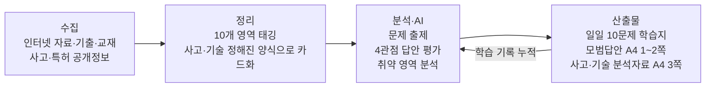

# AI 기반 가스기술사 학습·기술정보 통합 지원 시스템 — 프로젝트 기획서

| 항목 | 내용 |
|---|---|
| 리포 | data09-02 |
| 제출자 | 신은배 |
| 직무·소속 | 유틸리티 담당 / 울산캠퍼스 상생지원팀 |
| 과정 | 현장 데이터 디지털화 전문가과정 1차수 |
| 작성일 | 2026-09-28 |
| 문서 상태 | 초안 v0.2 — 수강생 제출 자료 기반 + 2026-09-29 수강생 추가 요청(AI 자동 평가·모범답안, 가스사고 기사 목록) 반영 (11장) |

## 1. 추진 배경과 현안

- 제출자는 현재 가스기술사 시험을 준비하고 있습니다.
- 기술사 공부는 단순 암기보다 이론 이해, 사고사례 분석, 법규·설비 적용, 최신 기술 동향을 종합적으로 판단하는 능력이 중요하다고 보고 있습니다.
- 이 공부를 유틸리티(가스 설비 포함, (가정)) 실무와 연결해, 시험 준비와 실무 역량 향상을 동시에 지원하는 개인형 AI 도구를 만들고자 합니다.
- 현안을 정리하면 다음 세 가지입니다.
  1. 매일 풀 기술사 문제를 스스로 만들고 채점받기 어렵다.
  2. 국내 가스사고 사례가 흩어져 있어 답안에 쓸 수 있는 형태(원인·메커니즘·대책)로 정리돼 있지 않다.
  3. 특허·신기술 동향을 답안에 연결할 수 있는 형태로 관리하지 못하고 있다.

## 2. 목표

**최종 목표**

「가스기술사 시험 준비 + 사고사례 DB + 가스 신기술 DB」를 결합한 AI 기반 개인형 가스기술 지식관리 시스템을 구축합니다.
학습이 누적될수록 AI가 부족한 분야를 분석해 출제 비중을 조절하고, 과거 사고와 최신 기술을 기술사 답안에 연결하도록 발전시킵니다.

**1차 개발 목표**

「① 가스기술사 필기 모의시험」 모듈을 먼저 만듭니다.
10개 영역에서 하루 1문제씩 총 10문제를 출제하고, [문제] → [사용자 답안 작성] → [AI 평가] → [모범답안 공개] 흐름을 브라우저에서 돌게 합니다.
AI 평가는 4개 전문 관점(가스기술사·공학박사·채점위원·전문기자)으로 나누어 보여 줍니다.
사고사례 DB와 신기술 DB는 1차에서 **입력 양식과 저장 구조만** 만들고, 내용 채우기는 2단계로 넘깁니다(이유: 8장·10장 참조 — 사실 확인이 필요한 데이터이기 때문).

## 3. 보유 데이터

| 데이터 | 형태 | 규모·주기 | 비고(민감도 등) |
|---|---|---|---|
| 인터넷 자료 (제출자 기재) | 웹 문서 (구체 출처 미기재) | 미기재 | 공개 자료. 출처별 신뢰도 차이가 큼 |
| 출제 영역 10개 (제출자 정의) | 목록 | 10개 영역 고정 | 연소·폭발공학 / 방폭공학 / 기초역학 / 연소기기 및 가스용품 / 고압가스 / LPG 설비 / 도시가스 / 수소안전 / 가스용기 / 저장탱크 |
| 국내 가스사고 사례 | 미확보 (구축 대상) | 1970년대 ~ 최근 | 공개 사고 정보. 1차 출처 확인 필요 |
| 국내 가스 관련 특허·신기술 | 미확보 (구축 대상) | 1970년대 ~ 최근, 최근 5년 중점 | 특허 공개 정보. 대상 분야 예시 7개(아래 5장) |
| 제출자 본인 답안·학습 기록 | 시스템 사용 중 생성 | 하루 최대 10건 (가정: 매일 10문제 모두 풀 경우) | 개인 학습 데이터 |

- 첨부파일은 없습니다. 기존 기출문제·교재·요약노트 등 보유 자료가 있는지는 10장에서 확인합니다.
- 이 과제는 회사 현장 데이터가 아니라 개인 학습용 공개 자료를 다룹니다. 회사 내부 자료를 넣을 계획이 있다면 보안 검토가 따로 필요합니다(가정).

## 4. 해결 방안 개요

- **수집**: 공개 자료를 사람이 고르고, 출처(URL·문서명·발행기관)를 함께 저장합니다.
- **정리**: 사고는 [사고 개요] → [사고 원인] → [사고발생 메커니즘] → [재발방지대책] → [가스기술사 종합의견], 기술은 [기술명] → [기술 정의] → [기존 기술의 문제점] → [핵심 기술] → [적용 분야] → [향후 발전방향] 양식으로 고정합니다.
- **분석·AI**: 생성형 AI에 4개 역할을 부여해 같은 답안을 네 관점에서 검토하게 하고, 마지막에 종합 의견을 냅니다.
- **산출물**: 문제·답안·평가·모범답안이 날짜별로 쌓이고, 영역별 점수 추이가 보입니다.

## 5. 주요 기능

| 기능 | 설명 | 우선순위 |
|---|---|---|
| 일일 모의시험 출제 | 10개 영역에서 1문제씩 총 10문제 생성. 이미 푼 문제와 겹치지 않게 출제 이력 참조 | MVP |
| 답안 작성 화면 | 문제별 답안 입력(서론-본론-결론 칸 안내). 임시저장 | MVP |
| 4관점 AI 평가 | 가스기술사(현장 실무) / 공학박사(이론·공학 근거) / 채점위원(답안 구성·채점) / 전문기자(사고·동향·신기술) 관점으로 각각 평가 후 종합 의견 | MVP |
| 모범답안 공개 | 기술사 시험 형식, A4 1~2페이지, 서론-본론-결론 구조 | MVP |
| 학습 기록·영역별 현황 | 날짜·영역·점수 기록, 영역별 누적 점수 표·그래프 | MVP |
| 기록 내보내기 | 학습 기록을 Excel/CSV·인쇄용(PDF)으로 저장 | MVP |
| 취약 영역 가중 출제 | 점수가 낮은 영역의 출제 비중을 높임(10문제 틀 안에서 비율 조정 또는 추가 문제, 방식은 10장 확인) | 확장 |
| 사고사례 DB | 1970년대~최근 국내 가스 누출·화재·폭발 사고 카드. 선택하면 A4 3페이지 이내 기술 분석자료 생성 | 확장(1차는 입력 양식만) |
| 특허·신기술 DB | 최근 5년 중점. 수소 저장·운송 / 가스누출 감지 / 스마트 가스안전관리 / AI 기반 이상감지 / 방폭 / 고압가스 저장 / 도시가스 안전기술 등. A4 3페이지 이내 기술자료 | 확장(1차는 입력 양식만) |
| 답안-사례 연결 | 모범답안 작성 시 관련 사고사례·신기술 카드를 근거로 인용 | 확장 |
| 출처 표시 | 사고·기술 카드마다 1차 출처 필수 입력, 출처 없는 카드는 「미확인」 표시 | 확장(DB와 함께 필수) |

## 6. 기대 산출물

- 브라우저에서 여는 개인형 가스기술사 학습 도구(웹 페이지 1개).
- 일일 10문제 학습 세트(문제·본인 답안·4관점 평가·모범답안)와 그 누적 기록.
- 영역별 학습 현황표(Excel/CSV 내보내기 포함).
- 사고사례 카드 양식·특허/신기술 카드 양식(1차), 이후 채워진 DB(2단계 이후).
- 4관점 평가용 프롬프트 세트(DAY4 Dify 에이전트로 옮겨 쓸 수 있는 형태).

## 7. 기술 구성

| 과정 도구 | 이 과제에서의 쓰임 |
|---|---|
| 생성형 AI (ChatGPT·Claude 등) | 문제 출제, 4관점 평가, 모범답안 작성. 역할별 프롬프트로 분리 |
| Dify 클라우드 (DAY4) | 4개 역할 에이전트 + 사고·신기술 자료를 지식베이스(RAG)로 연결. 근거 문서를 인용하며 답하게 함 |
| NotebookLM (DAY4) | 제출자가 모은 교재·기출·사고 보고서를 올려 출처 기반 요약·질의 |
| Make (DAY5) | 매일 정해진 시각에 10문제를 생성해 Gmail로 보내고, 답안·점수를 Google Sheets에 기록(선택) |
| 코랩/Python (DAY2) | 누적 학습 기록 분석(영역별 점수 추이), 사고 데이터 정리 |

**개발 형태 (우리가 만드는 것)**

- **설치 없이 브라우저에서 도는 정적 웹 도구**(HTML + JavaScript 한 묶음).
- 학습 기록은 브라우저 저장소에 두고, Excel/CSV로 내보내기·불러오기를 제공합니다(기기를 바꿔도 이어서 쓰도록).
- AI 호출은 두 가지 방식 중 하나로 정합니다(10장 확인).
  - 방식 1: 사용자가 본인 API 키를 넣어 도구가 직접 호출.
  - 방식 2: 도구는 「프롬프트 생성 + 결과 붙여넣기」만 하고, 실제 AI 대화는 사용자가 쓰는 ChatGPT/Claude 창에서 수행(키·비용 부담 없음).
- 10개 영역·4개 역할·양식 구조는 설정 파일로 분리해 나중에 바꾸기 쉽게 합니다.

## 8. 개발 단계

**1단계 — 지금 바로 개발 가능한 부분**

지금 가진 정보(10개 영역 목록, 학습 흐름, 4개 역할 정의, 사고·기술 카드 양식)만으로 만들 수 있습니다. 외부 데이터가 없어도 됩니다.

- 10개 영역 × 하루 1문제 출제 화면과 [문제] → [답안] → [AI 평가] → [모범답안] 4단계 흐름.
- 4관점 평가 프롬프트 세트(역할별 평가 기준, 종합 의견 형식, 모범답안의 A4 1~2쪽·서론-본론-결론 형식 지시).
- 날짜별 학습 기록 저장, 영역별 현황표, Excel/CSV 내보내기.
- 사고 카드(5항목)·기술 카드(6항목) 빈 입력 양식과 저장 구조, 출처 입력 칸.

**2단계**

- 사고사례·특허/신기술 카드 채우기. 제출자가 모은 1차 출처 자료를 바탕으로 AI가 양식에 맞춰 초안을 쓰고, 제출자가 검토·확정합니다.
- 카드 선택 시 A4 3페이지 이내 분석자료 생성·인쇄.
- Dify 지식베이스에 확정된 카드를 올려, 평가·모범답안이 사례를 인용하도록 연결.

**3단계**

- 누적 점수 기반 취약 영역 가중 출제.
- 모범답안 작성 시 관련 사고·신기술 자동 추천·인용.
- Make로 매일 출제 메일 발송과 Google Sheets 기록 자동화(원할 경우).

## 9. 기대 효과

- 매일 10개 영역을 고르게 훈련하는 습관이 만들어지고, 스스로 채점하기 어려운 서술형 답안을 네 관점에서 피드백받을 수 있습니다.
- 채점위원 관점 평가로 답안 구성(서론-본론-결론)을 시험 형식에 맞추는 연습이 됩니다.
- 사고사례와 신기술을 같은 양식으로 정리해 두면, 답안 작성과 실무 가스안전관리 업무에서 함께 쓸 수 있습니다.
- 학습이 쌓일수록 부족한 영역이 수치로 드러나 공부 계획을 세우기 쉬워집니다.

## 10. 확인 필요 사항

**사실 정확성 관련 (가장 중요)**

- 생성형 AI는 사고 일시·장소·피해 규모, 특허 번호·출원인 같은 사실을 그럴듯하게 지어낼 수 있습니다. 사고사례·특허 DB는 **1차 출처가 확인된 자료만** 싣는 것을 원칙으로 하려 합니다. 제출자가 참고하려는 출처(예: 가스안전 관련 공공기관의 사고 통계·보고서, 특허 검색 서비스 등 — 구체 기관명은 제출자 확인 필요)를 알려 주십시오.
- 모범답안의 법규·기준 조항 인용도 같은 위험이 있습니다. 법령·KGS 코드 등 기준 문서를 따로 확보해 근거로 붙일지 확인이 필요합니다(가정: 기준 문서를 지식베이스로 넣는 방식).

**요구사항 확인**

- 「매일 1문제씩 총 10문제」는 영역마다 1문제(하루 10문제)라는 뜻이 맞는지.
- 실제 가스기술사 시험 형식(교시별 문항 수, 단답형·논술형 구분)에 맞춰 문제 유형을 나눌지. 현재 원문에는 모범답안 A4 1~2쪽 형식만 적혀 있습니다.
- AI 평가를 점수(예: 100점 만점)로 매길지, 등급·코멘트로만 받을지. 네 관점 점수를 합산할지.
- 취약 영역 가중 출제는 10문제 안에서 영역 비율을 바꾸는 방식인지, 약한 영역 문제를 추가하는 방식인지.
- AI 호출 방식(본인 API 키 사용 / 채팅창 복사·붙여넣기 방식) 중 선호.
- PC만 쓰는지, 휴대폰에서도 풀고 싶은지.

**필요한 샘플·자료**

- 보유한 기출문제·교재 목차·요약노트가 있다면 출제 범위 정렬용으로 일부 제공.
- 본인이 쓴 답안 1~2개와 이상적이라고 보는 모범답안 1개(평가 기준 맞추기용).
- 사고사례·신기술 카드 예시로 삼을 자료 각 1건.

## 11. 2026-09-29 수강생 추가 요청

패들릿에 올라온 보완 요청 2건입니다. 원문 전체는 `docs/source/2026-09-29_패들릿_추가요청.md`.

### 11.1 3·4단계(AI 평가·모범답안)를 AI 가 자동으로

> 1단계~4단계 구성중 2단계 답안을 작성하면 3단계 AI 평가, 4단계 AI 모범답안 공개로 이루어집니다.
> 현재 상태에서는 3단계 AI 평가를 제가 직접 입력을 하게되고 4단계 AI 모범답안도 제가 직접 입력을 하게됩니다.
> 3~4단계는 AI가 자동으로 작성될 수 있게 할수 있을까요?

**반영 방식** — 10장의 「AI 호출 방식」 질문에 대한 답으로 보고 두 방식을 함께 둡니다.

- **자동 모드(선택)**: 「데이터」 메뉴나 3단계 화면에서 본인 OpenAI API 키를 넣으면, 답안을 제출하는 순간 브라우저가 OpenAI 에 직접 요청해 3단계(네 관점 점수·의견·종합의견)와 4단계(모범답안)를 채워 저장합니다. 모델은 설정에서 고르고 기본은 `gpt-4o-mini`(저렴한 모델)입니다.
  - 키는 이 브라우저(localStorage)에만 저장하고 화면에는 앞 3글자·끝 4글자만 보입니다. 「키 삭제」 버튼이 있습니다. 엑셀 내보내기·리포에는 들어가지 않습니다(공개 리포라 코드에 키를 넣을 수 없습니다).
  - 요금은 본인 OpenAI 계정에 청구됩니다. 받은 답변에서 점수가 빠지면 저장하지 않고 확인 칸을 보여 줍니다.
- **키가 없을 때**: 평가와 모범답안을 한 번에 요청하는 **통합 프롬프트**를 한 번 복사해 ChatGPT 등에 붙여 넣고, 받은 답변 전체를 붙여 넣으면 구분선(`=====평가=====` / `=====모범답안=====`) 또는 JSON 을 읽어 3·4단계 칸에 나눠 채웁니다. 이전의 「평가만 따로 → 모범답안 따로」 방식도 접어서 남겨 두었습니다.
- 통합 프롬프트에는 가스기술사 **답안 채점 기준**(서론·본론·결론 구성, 핵심 키워드, 도해, 분량 A4 1~2쪽)과 실제 **답안 글자 수**를 넣어 AI 가 분량을 어림하지 않게 했습니다. 기준 문구는 `js/config.js` 의 `GRADING_GUIDE` 에서 고칩니다.
- 「모범답안은 평가 뒤에만 열린다」는 1단계 순서 규칙은 그대로입니다(평가와 함께 저장).

**남은 확인사항**

- OpenAI 외 다른 AI(Claude·Gemini·사내 AI)를 쓰실지. 회사 PC 에서 `api.openai.com` 접속이 막혀 있는지.
- 채점 기준 4가지 문구와 분량 기준(1,000~2,500자)이 실제 답안지 기준과 맞는지.

### 11.2 사고 카드에 인터넷 가스사고 기사를 날짜순으로 자동 목록화

> 사고카드 내에 인터넷에서 가스사고 와 관련된 기사 내용들을 자동으로 날짜순으로 발췌하여 자동으로 목록화 시킬수 있을까요?

**그대로 못 하는 부분과 이유** — 이 도구는 서버 없이 브라우저에서만 도는 정적 웹이라, 뉴스 사이트를 직접 긁어 오면 브라우저 보안 규칙(CORS)이 막습니다. 기사 본문을 모아 저장·게시하는 것은 저작권 문제도 있습니다.

**반영 방식 (대안)** — 「사고 카드」 화면에 「가스사고 기사 (날짜순)」 탭을 두고 세 갈래로 모읍니다.

1. **매일 자동 수집 (가장 자동에 가까움)**: GitHub Actions(`.github/workflows/news.yml`)가 매일 아침 7시쯤 공개 뉴스 검색 RSS(Google 뉴스, 검색어 「가스사고·가스폭발·가스누출」)를 받아 `data/news.json` 을 갱신합니다. **제목·링크·날짜·언론사만** 저장하고 기사 본문은 저장하지 않습니다. 중복 기사는 한 건으로 합치고, 1년 지난 기사는 뺍니다. 화면은 이 파일을 읽어 날짜별로 묶어 최신순으로 보여 줍니다.
2. **RSS 직접 불러오기 시도**: 버튼으로 시도하되, 브라우저가 막으면(대부분) 이유를 안내합니다.
3. **기사 붙여넣기**: 목록에 없는 기사는 제목·날짜·주소·본문을 붙여 넣으면 날짜를 읽어(2026-09-28 · 2026.9.28 · 2026년 9월 28일 등) 날짜순으로 넣고 같은 기사는 한 번만 넣습니다. 본문은 앞부분 200자만 **발췌**해 이 브라우저에만 저장합니다.

- 기사마다 「사고 카드로」 버튼 → 제목·발생 시기·유형(폭발·화재·누출 추정)·출처 URL·언론사·발췌가 채워진 카드 초안이 열립니다. 출처는 「미확인」으로 시작합니다(기사는 1차 출처가 아니므로 10장 원칙대로 공공기관 보고서로 확인 후 체크).
- 목록은 CSV 로 내보낼 수 있습니다. 붙여넣은 기사는 엑셀 백업에 들어가지 않으니 필요하면 CSV 로 받아 두십시오.
- 컴퓨터에서 `index.html` 을 바로 열면(file://) 브라우저가 목록 파일 읽기를 막습니다. 자동 수집 목록은 온라인 주소(https://aebonlee.github.io/data09-02/)에서 보이고, 붙여넣기는 어디서나 됩니다.

**남은 확인사항**

- 검색어를 더 넣을지(예: LPG 사고, 도시가스 사고, 수소 충전소 사고). `js/config.js` 의 `NEWS.queries` 에서 고칩니다.
- 기사 「내용 발췌」를 자동으로 원하시면: 본문 저장 없이 AI 에게 기사 링크를 주고 사고 카드 5항목 초안을 받는 방식을 2단계 카드 채우기와 함께 붙일 수 있습니다.

## 부록. 제출 원문 요약

| 구분 | 내용 |
|---|---|
| 게시물 1 (2026-09-08 06:15) | 「AI 기반 가스기술사 학습·기술정보 통합 지원 시스템」. 추진 배경, AI 4개 역할 구성, ① 필기 모의시험(10개 영역), ② 국내 가스사고 사례 DB, ③ 국내 가스 관련 특허·신기술, 최종 목표, 교수 설명용 요약 |
| 첨부파일 | 없음 (attachments.json 비어 있음) |
| 원문 파일 | `data09-02/기획_원문.md` |
